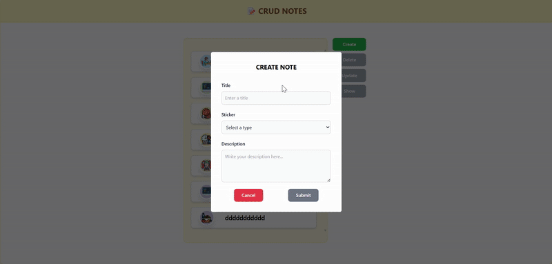
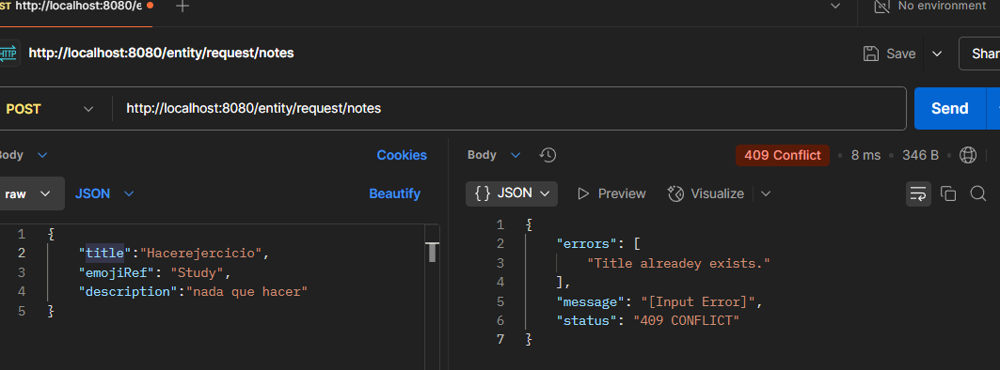

# 📝 CRUD Notes - Backend

Este proyecto es el **Backend de CRUD NOTES**, una aplicación web para gestionar notas con funcionalidades completas de **Crear, Leer, Actualizar y Eliminar**. Está desarrollada en **Java con Spring Boot**, conectada a una base de datos **MySQL** y cuenta con validaciones integradas para garantizar la integridad de los datos.

---

## 🚀 Tecnologías Usadas

- **Java 17**
- **Spring Boot 3+**
- **Spring Data JPA**
- **MySQL**
- **Hibernate Validator**
- **Lombok**
- **Maven**

---
### Avances

